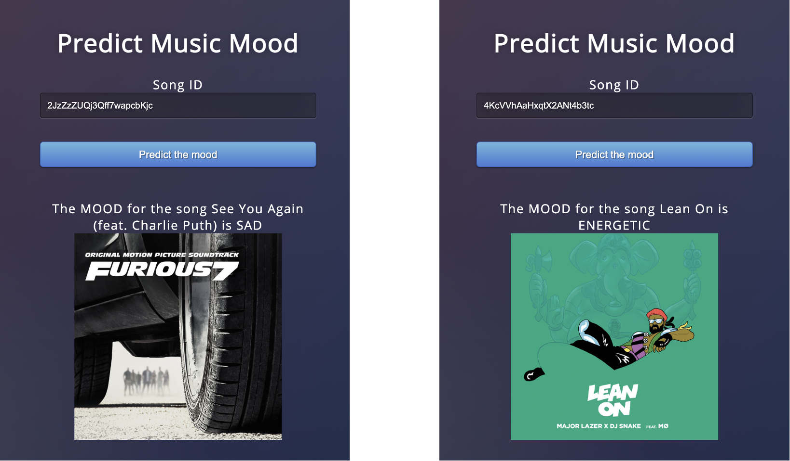

# Spotify: Music Mood Classification

-   Difficult to understand the different types of genres
- Develop a **music mood classifier** that can automatically distinguish songs based on mood and classify them as **Happy/Sad/Energetic** (categories that any user can easily understand)
- Use the classifier to find general trends about the mood of the songs from 1920-2021
- **How have the moods of the songs changed over time?**
- Use the classifier to find general trends about the mood of the songs in the Billboard Hot 100 playlist
- **What is the mood distribution of songs in the Billboard Hot 100 Playlist?**

## Steps

- **Data Aquisition** :  
  - Training the Model : Created a new dataset using **“Spotipy” – Python Library for Spotify Web API** (2000+ tracks)
  - Visualizations : 
    - Dataset1 - [1920-2021 songs Dataset Kaggle](https://www.kaggle.com/yamaerenay/spotify-dataset-19212020-160k-tracks)
    - Dataset2 - Combined **decade wise data from Billboard Hot 100 playlists (1950s – 2010s)** using Spotify Web API

- **Data Analysis** :
  - Used **K Nearest Neighbors Algorithm** and built a **Multi-Class Classification model** (used this model for further predictions)
  - Also built Random Forest, Decision Tree, and Deep Learning Model using Keras
  - Created a **Web App** to present Music Mood Prediction results


- **Data Visualization**
Used the classification model to predict the mood of the songs in datasets used for further analysis. Analyzed trends in the songs from 1920-2021 and also trends in the Billboard Hot 100 Playlist. The visualizations have been made in Tableau.


## Files

- Building_the_Music_Mood_Dataset.ipynb (Built the training dataset using Spotify Web API) Output File: spotify_songs_by_mood.csv
- Classification.ipynb (Classification models and creation of datasets used for visualizations) Output Files: labelled_songs_data.csv, billboard_decadewise_songs_data.csv
- utility_functions.py in SpotifyUtils Module which has functions for predicting mood of new songs, predicting mood of new playlist etc.
- Files for Web App : flask_spotify_app.py, templates/index.html, static/style.css, knn_model.pkl, scaler.pkl
- **Visualizations** : All_Songs_Visualizations.twbx, Billboard_Visualizations.twbx
- Presentation: CSE801_Presentation_Piplani_Srishti.pptx

## Web App

Predicts the mood of a song when the song ID is given as an input.


## Prediction Functions

```python
predict_new_song('2LcXJP95e4HKydTZ2mYfrx', model_KNN, mx)

predict_playlist_mood(['https://open.spotify.com/playlist/7asgcWtFGTbpZjl87J1OZJ'],\
                       model_KNN, mx)
```